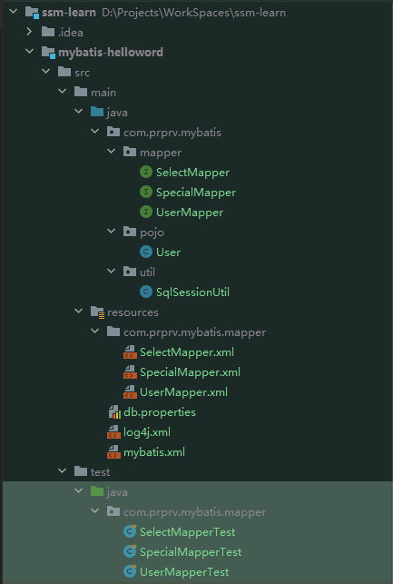
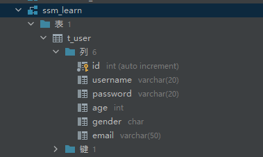
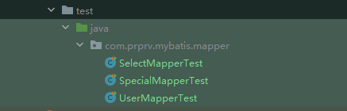

# SSM-HelloWord

MyBatis运行示例  

文件结构  


## MyBatis
需要自己在 resources 目录添加 db.properties 配置数据库信息

```properties
# 数据库配置信息
db.driver=com.mysql.cj.jdbc.Driver
db.url=jdbc:mysql://localhost:3306/ssm_learn?serverTimezone=UTC
db.username=
db.password=
```
数据库需要添加一个 User 表
```mysql
create table t_user
(
	id int auto_increment
		primary key,
	username varchar(20) null,
	password varchar(20) null,
	age int null,
	gender char null,
	email varchar(50) null
);
```


接下来运行 test 目录的单元测试



